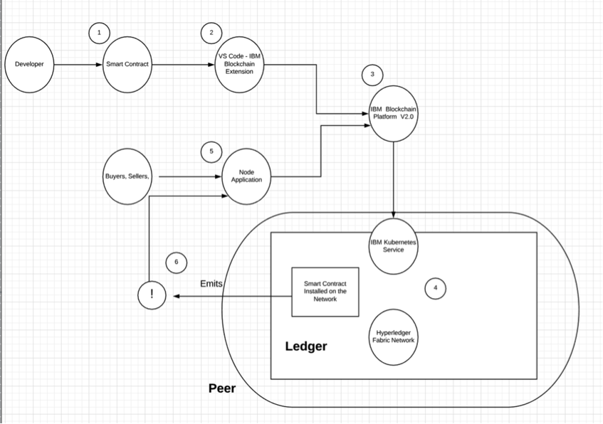

# auction-events

>Hyperledger Fabric sample Using Event Handling with IBM Blockchain Platform V2.0

This code pattern demonstrates leveraging the event handling feature within an application that is based on using an IKS cluster with IBM Blockchain Platform V2.0 service on IBM Cloud.  We apply this use case to an auction use case. It shows how events can be emitted by using the Hyperledger Fabric SDK and subscribed to by external applications.  The application is implemented in Node.js and is using the Hyperledger Fabric SDK for node.js to connect with the network, set up an event listener and catch tranactional events.

A client application may use the Fabric Node.js client to register a "listener" to receive blocks as they are added to the channel ledger. This is known as "channel-based events", and it allows a client to start to receive blocks from a specific block number, allowing event processing to run normally on blocks that may have been missed. The Fabric Node.js client can also assist client applications by processing the incoming blocks and looking for specific transactions or chaincode events. This allows a client application to be notified of transaction completion or arbitrary chaincode events without having to perform multiple queries or search through the blocks as they are received.  After the transaction proposal has been successfully endorsed, and before the transaction message has been successfully broadcasted to the orderer, the application should register a listener to be notified of the event when the transaction achieves finality, which is when the block containing the transaction gets added to the peer's ledger/blockchain. 

Fabric committing peers provides an event stream to publish blocks to registered listeners. A Block gets published whenever the committing peer adds a validated block to the ledger. There are three ways to register a listener to get notified:

* register a `block listener` to get called for every block event. The listener will be passed a fully decoded Block object.

* register a `transaction listener` to get called when the specific transaction by id is committed (discovered inside a published block). The listener will be passed the transaction id, transaction status and block number.

* register a `chaincode event listener` to get called when a specific chaincode event has arrived. The listener is be passed the ChaincodeEvent, block number, transaction id, and transaction status. 

In this pattern we are registering a transaction event. So when a transaction is completed/committed - an event will get triggered and the application will catch it and report it. 

Audience level : Intermediate Developers

If you have an IBM Cloud Lite account, you can also use the IBM Blockchain Platform Service free for 30 days to do this pattern. Additionally, IKS is free too.


When you have completed this code pattern, you will understand how to:

* Package the smart contract using IBM Blockchain Platform Extension for VS Code
* Setup a Hyperledger Fabric network on IBM Blockchain Platform 2.0
* Install and instantiate smart contract package onto the IBM Blockchain Platform 2.0
* Develop a Node.js server with the Hyperledger Fabric SDK to interact with the deployed network and setup your applications to trigger and catch events

# Architecture flow
***UPDATE***

<p align="center">
  
</p>

1. The developer develops a smart contract using Node.js
2. Use the IBM Blockchain Platform Extension for VS Code to package the Decentralized Energy smart contract.
3. Setup and launch the IBM Blockchain Platform 2.0 service
4. The IBM Blockchain Platform 2.0 enables the creation of a network onto a IBM Kubernetes Service, enabling installation and instantiation of the Auction smart contract on the network
5.  The Node.js application uses the Fabic SDK to add a listener to specific transactions and subsequently interact with the deployed network on IBM Blockchain Platform 2.0 and issues transactions.
6.  Events are emitted as transactions are triggered and blocks are committed to the ledger. The events are sent back to the Node.js application.


# Included components
*   [IBM Blockchain Platform 2.0](https://console.bluemix.net/docs/services/blockchain/howto/ibp-v2-deploy-iks.html#ibp-v2-deploy-iks) gives you total control of your blockchain network with a user interface that can simplify and accelerate your journey to deploy and manage blockchain components on the IBM Cloud Kubernetes Service.
*   [IBM Cloud Kubernetes Service](https://www.ibm.com/cloud/container-service) creates a cluster of compute hosts and deploys highly available containers. A Kubernetes cluster lets you securely manage the resources that you need to quickly deploy, update, and scale applications.
* [IBM Blockchain Platform Extension for VS Code](https://marketplace.visualstudio.com/items?itemName=IBMBlockchain.ibm-blockchain-platform) is designed to assist users in developing, testing, and deploying smart contracts -- including connecting to Hyperledger Fabric environments. 

## Featured technologies
+ [Hyperledger Fabric v1.4](https://hyperledger-fabric.readthedocs.io) is a platform for distributed ledger solutions, underpinned by a modular architecture that delivers high degrees of confidentiality, resiliency, flexibility, and scalability.
+ [Node.js](https://nodejs.org) is an open source, cross-platform JavaScript run-time environment that executes server-side JavaScript code.
+ [Hyperledger Fabric SDK for node.js](https://fabric-sdk-node.github.io/release-1.4/index.html) provides a powerful API to interact with a Hyperledger Fabric blockchain. 


### Prerequisites
- [IBM Cloud account](https://cloud.ibm.com/registration/?target=%2Fdashboard%2Fapps)
- [Node v8.x or greater and npm v5.x or greater](https://nodejs.org/en/download/)
- [VSCode version 1.26 or greater](https://code.visualstudio.com)
- [IBM Blockchain Platform Extension for VSCode](https://marketplace.visualstudio.com/items?itemName=IBMBlockchain.ibm-blockchain-platform)

# Running the application

Follow these steps to set up and run this code pattern. The steps are described in detail below.

### Steps

1. [Clone the repo](#1-clone-the-repo)
2. [Package the smart contract](#2-package-the-smart-contract)
3. [Create IBM Cloud services](#3-create-ibm-cloud-services)
4. [Build a network](#4-build-a-network)
5. [Deploy Auction Event Smart Contract on the network](#5-deploy-auctionevent-smart-contract-on-the-network)
6. [Connect application to the network](#6-connect-application-to-the-network)
7. [Run the application](#7-run-the-application)


## 1. Clone the repo

Clone this repository in a folder of your choice:

```
git clone https://github.com/IBM/auction-events.git
```

# 2. Package the smart contract

We will use the IBM Blockchain Platform extension to package the smart contract.
* Open Visual Studio code and open the `contract` folder from  `auction-events` that was cloned earlier.

* Press the `F1` key to see the different VS code options. Choose `IBM Blockchain Platform: Package a Smart Contract Project`.

<p align="center">
  
</p>


* Click the `IBM Blockchain Platform` extension button on the left. This will show the packaged contracts on top and the blockchain connections on the bottom. **Note** You will see `auction@0.0.1` instead of globalfinancing@1.0.0.


<p align="center">
  
</p>

* Next, right click on the packaged contract (in this case, select auction@0.0.1) to export it and choose `Export Package`.

* Choose a location on your machine and save `.cds` file.  We will use this packages smart contract later to deploy on the IBM Blockchain Platform 2.0 service.


Now, we will start creating our Hyperledger Fabric network on the IBM Cloud.

## 3. Create IBM Cloud services

* Create the [IBM Cloud Kubernetes Service](https://cloud.ibm.com/catalog/infrastructure/containers-kubernetes).  You can find the service in the `Catalog`.  For this code pattern, we can use the `Free` cluster, and give it a name.  Note, that the IBM Cloud allows one instance of a free cluster and expires after 30 days.

<br>
<p align="center">
  
</p>
<br>

* Create the [IBM Blockchain Platform 2.0](https://console.bluemix.net/catalog/services/blockchain/) service on the IBM Cloud.  You can find the service in the `Catalog`, and give a name.

<br>
<p align="center">
  
</p>
<br>

* After your kubernetes cluster is up and running, you can deploy your IBM Blockchain Platform on the cluster.  The service walks through few steps and finds your cluster on the IBM Cloud to deploy the service on.

<br>
<p align="center">
  
</p>
<br>

* Once the Blockchain Platform is deployed on the Kubernetes cluster, you can launch the console to start operating on your blockchain network.

<br>
<p align="center">
  
</p>
<br>

## 4. Build a network

We will build out the network as provided by the IBM Blockchain Platform [documentation](https://console.bluemix.net/docs/services/blockchain/howto/ibp-console-build-network.html#ibp-console-build-network).  This will include creating a channel with a single peer organization with its own MSP and CA (Certificate Authority), and an orderer organization with its own MSP and CA. We will create the respective identities to deploy peers and operate nodes.

### Create your organization and your entry point to your blockchain

* #### Create your peer organization CA
  - Click <b>Add Certificate Authority</b>.
  - Click <b>IBM Cloud</b> under <b>Create Certificate Authority</b> and <b>Next</b>.
  - Give it a <b>Display name</b> of `Org1 CA`.  
  - Specify an <b>Admin ID</b> of `admin` and <b>Admin Secret</b> of `adminpw`.

<br>
<p align="center">
  
</p>
<br>


* #### Use your CA to register identities
  - Select the <b>Org 1 CA</b> Certificate Authority that we created.
  - First, we will register an admin for our organization "org1". Click on the <b>Register User</b> button.  Give an <b>Enroll ID</b> of `org1admin`, and <b>Enroll Secret</b> of `org1adminpw`.  Click <b>Next</b>.  Set the <b>Type</b> for this identity as `client` and select from any of the affiliated organizations from the drop-down list. We will leave the <b>Maximum enrollments</b> and <b>Add Attributes</b> fields blank.
  - We will repeat the process to create an identity of the peer. Click on the <b>Register User</b> button.  Give an <b>Enroll ID</b> of `peer1`, and <b>Enroll Secret</b> of `peer1pw`.  Click <b>Next</b>.  Set the <b>Type</b> for this identity as `peer` and select from any of the affiliated organizations from the drop-down list. We will leave the <b>Maximum enrollments</b> and <b>Add Attributes</b> fields blank.

<br>
<p align="center">
  
</p>
<br>


* #### Create the peer organization MSP definition
  - Navigate to the <b>Organizations</b> tab in the left navigation and click <b>Create MSP definition</b>.
  - Enter the <b>MSP Display name</b> as `Org1 MSP` and an <b>MSP ID</b> of `org1msp`.
  - Under <b>Root Certificate Authority</b> details, specify the peer CA that we created `Org1 CA` as the root CA for the organization.
  - Give the <b>Enroll ID</b> and <b>Enroll secret</b> for your organization admin, `org1admin` and `org1adminpw`. Then, give the Identity name, `Org1 Admin`.
  - Click the <b>Generate</b> button to enroll this identity as the admin of your organization and export the identity to the wallet. Click <b>Export</b> to export the admin certificates to your file system. Finally click <b>Create MSP definition</b>.

<br>
<p align="center">
  
</p>
<br>


* Create a peer
  - On the <b>Nodes</b> page, click <b>Add peer</b>.
  - Click <b>IBM Cloud</b> under Create a new peer and <b>Next</b>.
  - Give your peer a <b>Display name</b> of `Peer Org1`.
  - On the next screen, select `Org1 CA` as your <b>Certificate Authority</b>. Then, give the <b>Enroll ID</b> and <b>Enroll secret</b> for the peer identity that you created for your peer, `peer1`, and `peer1pw`. Then, select the <b>Administrator Certificate (from MSP)</b>, `Org1 MSP`, from the drop-down list and click <b>Next</b>.
  - Give the <b>TLS Enroll ID</b>, `admin`, and <b>TLS Enroll secret</b>, `adminpw`, the same values are the Enroll ID and Enroll secret that you gave when creating the CA.  Leave the <b>TLS CSR hostname</b> blank.
  - The last side panel will ask you to <b>Associate an identity</b> and make it the admin of your peer. Select your peer admin identity `Org1 Admin`.
  - Review the summary and click <b>Add Peer</b>.

<br>
<p align="center">
  
</p>
<br>

### Create the node that orders transactions

* #### Create your orderer organization CA
  - Click <b>Add Certificate Authority</b>.
  - Click <b>IBM Cloud</b> under <b>Create Certificate Authority</b> and <b>Next</b>.
  - Give it a unique <b>Display name</b> of `Orderer CA`.  
  - Specify an <b>Admin ID</b> of `admin` and <b>Admin Secret</b> of `adminpw`.

<br>
<p align="center">
  
</p>
<br>

* #### Use your CA to register orderer and orderer admin identities
  - In the <b>Nodes</b> tab, select the <b>Orderer CA</b> Certificate Authority that we created.
  - First, we will register an admin for our organization. Click on the <b>Register User</b> button.  Give an <b>Enroll ID</b> of `ordereradmin`, and <b>Enroll Secret</b> of `ordereradminpw`.  Click <b>Next</b>.  Set the <b>Type</b> for this identity as `client` and select from any of the affiliated organizations from the drop-down list. We will leave the <b>Maximum enrollments</b> and <b>Add Attributes</b> fields blank.
  - We will repeat the process to create an identity of the orderer. Click on the <b>Register User</b> button.  Give an <b>Enroll ID</b> of `orderer1`, and <b>Enroll Secret</b> of `orderer1pw`.  Click <b>Next</b>.  Set the <b>Type</b> for this identity as `peer` and select from any of the affiliated organizations from the drop-down list. We will leave the <b>Maximum enrollments</b> and <b>Add Attributes</b> fields blank.

<br>
<p align="center">
  
</p>
<br>


* #### Create the orderer organization MSP definition
  - Navigate to the <b>Organizations</b> tab in the left navigation and click <b>Create MSP definition</b>.
  - Enter the <b>MSP Display name</b> as `Orderer MSP` and an <b>MSP ID</b> of `orderermsp`.
  - Under <b>Root Certificate Authority</b> details, specify the peer CA that we created `Orderer CA` as the root CA for the organization.
  - Give the <b>Enroll ID</b> and <b>Enroll secret</b> for your organization admin, `ordereradmin` and `ordereradminpw`. Then, give the <b>Identity name</b>, `Orderer Admin`.
  - Click the <b>Generate</b> button to enroll this identity as the admin of your organization and export the identity to the wallet. Click <b>Export</b> to export the admin certificates to your file system. Finally click <b>Create MSP definition</b>.

<br>
<p align="center">
  
</p>
<br>

* #### Create an orderer
  - On the <b>Nodes</b> page, click <b>Add orderer</b>.
  - Click <b>IBM Cloud</b> and proceed with <b>Next</b>.
  - Give your peer a <b>Display name</b> of `Orderer`.
  - On the next screen, select `Orderer CA` as your <b>Certificate Authority</b>. Then, give the <b>Enroll ID</b> and <b>Enroll secret</b> for the peer identity that you created for your orderer, `orderer1`, and `orderer1pw`. Then, select the <b>Administrator Certificate (from MSP)</b>, `Orderer MSP`, from the drop-down list and click <b>Next</b>.
  - Give the <b>TLS Enroll ID</b>, `admin`, and <b>TLS Enroll secret</b>, `adminpw`, the same values are the Enroll ID and Enroll secret that you gave when creating the CA.  Leave the <b>TLS CSR hostname</b> blank.
  - The last side panel will ask to <b>Associate an identity</b> and make it the admin of your peer. Select your peer admin identity `Orderer Admin`.
  - Review the summary and click <b>Add Orderer</b>.

<br>
<p align="center">
  
</p>
<br>

* #### Add organization as Consortium Member on the orderer to transact
  - Navigate to the <b>Nodes</b> tab, and click on the <b>Orderer</b> that we created.
  - Under <b>Consortium Members</b>, click <b>Add organization</b>.
  - From the drop-down list, select `Org1 MSP`, as this is the MSP that represents the peer's organization org1.
  - Click <b>Submit</b>.

<br>
<p align="center">
  
</p>
<br>


### Create and join channel

* #### Create the channel
  - Navigate to the <b>Channels</b> tab in the left navigation.
  - Click <b>Create channel</b>.
  - Give the channel a name, `mychannel`.
  - Select the orderer you created, `Orderer` from the orderers drop-down list.
  - Select the MSP identifying the organization of the channel creator from the drop-down list. This should be `Org1 MSP (org1msp)`.
  - Associate available identity as `Org1 Admin`.
  - Click <b>Add</b> next to your organization. Make your organization an <b>Operator</b>.
  - Click <b>Create</b>.

<br>
<p align="center">
  
</p>
<br>


* #### Join your peer to the channel
  - Click <b>Join channel</b> to launch the side panels.
  - Select your `Orderer` and click <b>Next</b>.
  - Enter the name of the channel you just created. `mychannel` and click <b>Next</b>.
  - Select which peers you want to join the channel, click `Peer Org1` .
  - Click <b>Submit</b>.

<br>
<p align="center">
  
</p>
<br>

## 5. Deploy the Auction Event Smart Contract on the network


* #### Install a smart contract (**note**: substitute the word `auction` where ever  you see the word `fabcar` in the graphics)
  - Click the <b>Smart contracts</b> tab to install the smart contract.
  - Click <b>Install smart contract</b> to upload the Auction smart contract package file, which you packaged earlier using the Visual Studio code extension.
  - Click on <b>Add file</b> and find your packaged smart contract.  
  - Once the contract is uploaded, click <b>Install</b>.


<br>
<p align="center">
  
</p>
<br>

* #### Instantiate smart contract (**note**: substitute the word `auction` where ever  you see the word `fabcar` in the graphics)
  - On the smart contracts tab, find the smart contract from the list installed on your peers and click <b>Instantiate</b> from the overflow menu on the right side of the row.
  - On the side panel that opens, select the channel, `mychannel` to instantiate the smart contract on. Click <b>Next</b>.
  - Select the organization members to be included in the policy, `org1msp`.  Click <b>Next</b>.
  - Give <b>Function name</b> of `instantiate` and leave <b>Arguments</b> blank. **Note:** `instantiate` is the method in the `my-contract.js` file that initiates the smart contracts on the peer.  Some may name this `initLedger`.
  - Click <b>Instantiate</b>.

<br>
<p align="center">
  
</p>
<br>

## 6. Connect application to the network

* #### Connect with sdk through connection profile (**note**: substitute the word `auction` where ever  you see the word `fabcar` in the graphics)
  - Under the Instantiated Smart Contract, click on `Connect with SDK` from the overflow menu on the right side of the row.
  - Choose from the dropdown for <b>MSP for connection</b>, `org1msp`.
  - Choose from <b>Certificate Authority</b> dropdown, `Org1 CA`.
  - Download the connection profile by scrolling down and clicking <b>Download Connection Profile</b>.  This will download the connection json which we will use soon to establish connection.
  - You can click <b>Close</b> once the download completes.

<br>
<p align="center">
  
</p>
<br>

* #### Create an application admin
  - Go to the <b>Nodes</b> tab on the left bar, and under <b>Certificate Authorities</b>, choose your organization CA, <b>Org1 CA</b>.
  - Click on <b>Register user</b>.
  - Give an <b>Enroll ID</b> and <b>Enroll Secret</b> to administer your application users, `app-admin` and `app-adminpw`.
  - Choose `client` as <b>Type</b> and any organization for affiliation.  We can pick `org1` to be consistent.
  - You can leave the <b>Maximum enrollments</b> blank.
  - Under <b>Attributes</b>, click on <b>Add attribute</b>.  Give attribute as `hf.Registrar.Roles` = `*`.  This will allow this identity to act as registrar and issues identities for our app.  Click <b>Add-attribute</b>.
  - Click <b>Register</b>.

<br>
<p align="center">
  
</p>
<br>


* #### Update application connection
  - Copy the connection profile you downloaded into [application folder](application)
  - Update the [config.json](application/config.json) file with:
  - The connection json file name you downloaded. 
  - The <b>enroll id</b> and <b>enroll secret</b> for your app admin, which we earlier provided as `app-admin` and `app-adminpw`.
  - The <b>orgMSP ID</b>, which we provided as `org1msp`.
  - The <b>caName</b>, which can be found in your connection json file under "organization" -> "org1msp" -> certificateAuthorities". This would be like an IP address and a port.
  - The <b>peer</b>, , which can be found in your connection json file under "organization" -> "org1msp" -> peers". This would be like an IP address and a port.
  - The username you would like to register.
  - Update gateway discovery to `{ enabled: true, asLocalhost: false }` to connect to IBP.


```bash
 {
   "channel_name": "mychannel",
    "smart_contract_name": "auction",
    "connection_file": "mychannel_auction_profile.json",
    "appAdmin": "app-admin",
    "appAdminSecret": "app-adminpw",
    "orgMSPID": "org1msp",
    "caName": "173.193.79.114:32615",
    "peer": "grpcs://173.193.79.114:30324",
    "orderer": "grpcs://173.193.79.114:32018",
    "userName": "user1",
    "gatewayDiscovery": { "enabled": true, "asLocalhost": false }
 }
```

## 7. Run the application

* #### Enroll admin
  - First, navigate to the `application` directory, and install the node dependencies.
  
    ```bash
    cd application
    npm install
    ```

  - Run the `enrollAdmin.js` script
  
    ```bash
    node enrollAdmin.js
    ```

This will create a directory called `wallet` and insert the user Admin along with its certificate authority.

  - You should see the following in the terminal:
  
    ```bash
    msg: Successfully enrolled admin user app-admin and imported it into the wallet
    ```


  - In the newest version of the Hyperledger Fabric Node SDK (1.4 release) there are 
  three main event types that can be subscribed to
    1. <b>Contract events</b> - these have to be emitted from the chaincode by calling the
    [stub.setEvent(name,payload) method](https://fabric-shim.github.io/master/fabric-shim.ChaincodeStub.html#setEvent__anchor). An example can be seen 
    in the auction chaincode on [line 141 of contract/lib/auction.js](https://github.com/IBM/auction-events/blob/master/contract/lib/auction.js#L141). These types of 
    events are great, since you can customize exactly what data you want to send 
    to the client application. Note that these events will only be triggered once 
    a certain function within your chaincode is called. 
    2. <b>Transaction (Commit) events</b> - these are automatically emitted 
    after a transaction is committed to the ledger.
    3. <b> Block events </b> - these are emitted automatically when a block is committed. 
    Note that there can be mutliple transactions in a block, so you may get multiple
    transaction events for one block event.
  
  - To illustrate each of these three main event types, we will have a separate script
  for each, that will show each of the events in action. First, let's check out the 
  `contractEvents.js` file. This file uses the `addContractListener` function to 
  look for any `TradeEvent` events that may be published from our chaincode. You can 
  see in our `contract` directory, that our `StartBidding`, `Offer`, and `CloseBidding` 
  functions all emit an event my calling `await ctx.stub.setEvent('TradeEvent', Buffer.from(JSON.stringify(tradeEvent)));` Then, our callback function in our `contractEvents.js` 
  file will fire once it has 
  detected that the `TradeEvent` is sent. Go ahead and run `contractEvents.js` by 
  typing in the following command in terminal

  ```javascript
    application$ node contractEvents.js 
    Wallet path: /Users/Horea.Porutiu@ibm.com/Workdir/testDir/auction-events/application/wallet
    gateway connect
    ************************ Start Trade Event *******************************************************
    type: Start Auction
    ownerId: auction@acme.org
    id: l1
    description: Sample Product
    status: {"code":1,"text":"FOR_SALE"}
    amount: 50
    buyerId: auction@acme.org
    Block Number: 124 Transaction ID: 
    6be255d6c2ab968ab9f0bd4bbc3477f51f1e02512d11e86fc509f2f6f0e51a7e Status: VALID
    ************************ End Trade Event ************************************
    closebiddingResponse: 
    {"listingId":"l1","offers":[{"bidPrice":100,"memberId":"memberB@acme.org"},{"bidPrice":50,"memberId":"memberA@acme.org"}],"productId":"p1","reservePrice":50,"state":"{\"code\":3,\"text\":\"SOLD\"}"}
    Transaction to close the bidding has been submitted
  ```

  This above output parses the trade event - it shows us the type of the event, the owner, the id, 
  the description of the product the status, etc. This is all things we have built and emitted within 
  our chaincode. Great. Now that we understand how contract events work, let's move onto the block 
  event listener. 

  - Block events are different than contract events since you have less control of what exactly 
  is being output. Go ahead and check out `blockEvents.js`. Note that there may be multiple 
  transactions within one block, and you can edit how many transactions are in your block by 
  editing the block batch size for a channel. You can read more details about this 
  [here](https://hyperledger-fabric.readthedocs.io/en/release-1.4/config_update.html). 
  The main components of the block are the block header, the block data, and the block
  metadata. 
    - The <b>block header</b> contains the block number, (starting at 0 from the genesis block)
    and increased by 1 for every new block appended to the blockchain. It also has 
    the current block hash (the hash of all transactions in the current block), and 
    the previous block hash.
    - The <b>block data</b> contains a list of the transactions in order. 
    - The <b>block metadata</b> contains the time when the block was written,
    the certificate, public key and signature of the block writer.

  - Go ahead and run the `blockEvents.js` script by typing in the following 
  commands in the terminal. For each `contract.submitTransaction` we submit,
  we will have a new block added to the ledger.
  Notice the output will be divided by header, 
  data, and metadata. You can then parse those respective parts of the output 
  to learn more about each specific part of the block.

  ```javascript
  application$ node blockEvents.js 
  Wallet path: /Users/Horea.Porutiu@ibm.com/Workdir/testDir/auction-events/application/wallet
  gateway connect
  *************** start block header **********************
  { number: '396',
    previous_hash: 'af979a1632e1ba69a75256dce4bafad40e93ebec6ee17de5b2923bbeb5abfec8',
    data_hash: '4db396d91151c432e1f17f32254565bc2445975d6d8c9000ff74a5c2a845dd26' }
  *************** end block header **********************
  *************** start block data **********************
  { signature: <Buffer 30 44 02 20 14 31 37 8d be 63 99 69 cc b7 35 30 b7 71 d8 0f 38 98 70 c6 7a cb fa a6 ed c3 a8 eb 28 c1 90 9f 02 20 05 4a 5d 66 61 4a 4f e9 42 37 11 b1 ... >,
    payload: 
    { header: 
        { channel_header: 
          { type: 3,
            version: 1,
            timestamp: '2019-08-30T00:10:45.075Z',
            channel_id: 'mychannel',
            tx_id: 'cb12f4a9209c0c35d20213c4d2c517c2b199761cb29902a11bc955eba291acc6',
            epoch: '0',
            extension: <Buffer 12 09 12 07 61 75 63 74 69 6f 6e>,
            typeString: 'ENDORSER_TRANSACTION' },
          signature_header: 
          { creator: 
              { Mspid: 'org1msp',
                IdBytes: '-----BEGIN CERTIFICATE-----\nMIICaTCCAhCgAwIBAgIUC2iFJ+dVTbE8QSVoqjjno3mT9sowCgYIKoZIzj0EAwIw\naDELMAkGA1UEBhMCVVMxFzAVBgNVBAgTDk5vcnRoIENhcm9saW5hMRQwEgYDVQQK\nEwtIeXBlcmxlZGdlcjEPMA0GA1UECxMGRmFicmljMRkwFwYDVQQDExBmYWJyaWMt\nY2Etc2VydmVyMB4XDTE5MDgyODE4MjQwMFoXDTIwMDgyNzE4MjkwMFowJjEPMA0G\nA1UECxMGY2xpZW50MRMwEQYDVQQDEwphcHAtYWRtaW4yMFkwEwYHKoZIzj0CAQYI\nKoZIzj0DAQcDQgAEMFDxKrg+VEO3mK5tfJKf7oULfagOMcAmX4T4NUmLI/ojsnTe\naTJUeJQQ3Vyp1L7pV3hZGvY9HlZUt6uVoLjju6OB2TCB1jAOBgNVHQ8BAf8EBAMC\nB4AwDAYDVR0TAQH/BAIwADAdBgNVHQ4EFgQU/GYKt2Q4Bk7aKon90K66rlgwWlAw\nHwYDVR0jBBgwFoAUUii9qu9Xs+cjOsm1MaM+xK1UCL4wdgYIKgMEBQYHCAEEansi\nYXR0cnMiOnsiaGYuQWZmaWxpYXRpb24iOiIiLCJoZi5FbnJvbGxtZW50SUQiOiJh\ncHAtYWRtaW4yIiwiaGYuUmVnaXN0cmFyLlJvbGVzIjoiKiIsImhmLlR5cGUiOiJj\nbGllbnQifX0wCgYIKoZIzj0EAwIDRwAwRAIgQEaWB8YVEfO67OAWLypnQX//0nrg\nOGtLqVv/HRkg2TsCIC4cn04cmTjLWg/GVGuXSLlaZV1SZFlGvd9lNDN2ytea\n-----END CERTIFICATE-----\n' },
            nonce: <Buffer fa 18 68 a7 a9 8b 74 10 8e 41 75 22 0d 74 8a 60 86 15 1f e3 13 59 d3 06> } },
      data: 
        { actions: 
          [ { header: 
                { creator: [Object],
                  nonce: <Buffer fa 18 68 a7 a9 8b 74 10 8e 41 75 22 0d 74 8a 60 86 15 1f e3 13 59 d3 06> },
              payload: { chaincode_proposal_payload: [Object], action: [Object] } } ] } } }
  *************** end block data **********************
  *************** start block metadata ****************
  { metadata: 
    [ { value: '\n\u0000\u0012\n\n\b\n\u0001\u0001\u0010\u0002\u0018�\u0003',
        signatures: 
          [ { signature_header: 
              { creator: [Object],
                nonce: <Buffer 0b f0 46 f5 17 1e 74 f3 c4 34 75 aa b0 85 80 f6 4e 4c d0 f5 ba a0 26 b4> },
              signature: <Buffer 30 45 02 21 00 b7 12 42 a3 43 21 8b a3 ea e1 56 af e4 63 2c 7e cc c6 c3 bf b7 e5 01 73 69 27 ce 4b 13 63 d3 5b 02 20 1d a1 e8 38 f6 fb 48 bb 3c 9a 01 ... > } ] },
      { value: { index: '0' }, signatures: [] },
      [ 0 ] ] }
  *************** end block metadata ****************
  ```
  To learn more about the specifics of what is included inside of a block, read this 
  [page](https://hyperledger-fabric.readthedocs.io/en/release-1.4/ledger/ledger.html#blocks).

  - Lastly, let's go ahead and listen for transaction events. This is even more 
  granular than block events, since multiple transactions can comprise a block.
  We will use the `transaction.addCommitListener` to listen to transactions. Go 
  ahead and look at the `transactionEvents.js` file. What we are doing, is that we are 
  adding a committ listener, such that when we submit a transaction, and it is 
  committed, we will get the transactionId, status, and blockheight back. Go 
  ahead and run `transactionEvents.js` file, and you should see the following 
  output in your terminal: 

  ```javascript
  application$ node transactionEvents.js 
  Wallet path: /Users/Horea.Porutiu@ibm.com/Workdir/testDir/auction-events/application/wallet
  gateway connect
  transaction committed
  'ef7f833d6039e41c5054d0bba0d327cfc14bfd7be836a6c5e65547320880d1af'
  'VALID'
  405
  transaction committed end
  Transaction to add seller has been submitted
  application$ 
  ```

 - In a second terminal window, run `node invoke-emit.js` script to will register a callback function to receive a notification when the `StartBidding` transaction has been committed onto a block.  You will see the following in the terminal:
 - 
**Things to Note** The text `assigning transaction id` is where a listener is attached to the transaction.  Then when the event occurs, you see the response: `Successfully sent Proposal and received ProsposalResponse: Status - 200..`
 
```bash
2019-02-21T06:05:42.247Z - error: [Client.js]: Channel not found for name mychannel
Got addressability to channel
Got addressability to contract
Assigning transaction_id:  7be0a0095ac2816454412dc2fe10b539ba9b70f32b965fe0469dc36a036945cd
Successfully loaded user1 from persistence
**Assigning transaction_id:  462c1c6283ed5cc83a64b44f94d989d36c5b0df594b63cd8ffa6332b78375844**
Transaction proposal was good
Successfully sent Proposal and received ProposalResponse: Status - 200, message - ""
event
{ chaincode_id: 'auction',
  tx_id: 'eb6b1d46e08e5f253236676da9e7c4ff694c741964ae72750516f746cf0d592e',
  event_name: 'TradeEvent',
  payload: <Buffer 7b 22 74 79 70 65 22 3a 22 53 74 61 72 74 20 41 75 63 74 69 6f 6e 22 2c 22 6f 77 6e 65 72 49 64 22 3a 22 61 75 63 74 69 6f 6e 40 61 63 6d 65 2e 6f 72 ... > }
Custom event received, payload: "{\"type\":\"Start Auction\",\"ownerId\":\"auction@acme.org\",\"id\":\"l1\",\"description\":\"Sample Product\",\"status\":\"{\\\"code\\\":1,\\\"text\\\":\\\"FOR_SALE\\\"}\",\"amount\":50,\"buyerId\":\"auction@acme.org\"}"

The transaction has been committed on peer 173.193.79.114:30324
Send transaction promise and event listener promise have completed
Successfully sent transaction to the orderer.
Successfully committed the change to the ledger by the peer
```


## Troubleshooting

* If you receive the following error on submitting transaction:
`error: [Client.js]: Channel not found for name mychannel`

  It is safe to ignore this error because the ibp2.0 beta has service discovery enabled. (In order to use service discovery to find other peers please define anchor peers for your channel in the ui). If you really want the message to go away you can add the channels section to the connection profile, but it is a warning rather than a true error telling the user the channel is found but not in the connection profile 

  As an example you can manually add the following json and updated the IP address and ports manually:

  ```
  "channels": {
          "mychannel": {
              "orderers": [
                  "169.46.208.151:32078"
              ],
              "peers": {
                  "169.46.208.151:31017": {}
              }
          }
      },
  ```

* In the invoke-emit.js application, you will see the following code:
It is important to note that in order for the `getClient` method to actually get the connection.profile content, you need to have line #4 occur before line #6.  If you don't, then the `client` constant will be `null`.  It is important you have the order correct to run the code successfully.

```bash
1. // A gateway defines the peers used to access Fabric networks
    
2.    await gateway.connect(ccp, { wallet, identity: appAdmin , discovery: {enabled: true, asLocalhost:false }});
3.    console.log('Connected to Fabric gateway.');

4.   const network = await gateway.getNetwork(channelName);
5.    // Get addressability to network

6.    const client = gateway.getClient();
    
7.    const channel = client.getChannel('mychannel');
8.    console.log('Got addressability to channel');
    
9.    const channel_event_hub = channel.getChannelEventHub('173.193.79.114:30324');
```

## Extending the code pattern
This application can be expanded in a couple of ways:
* Create a wallet for every member and use the member's wallet to interact with the application.
* Add a UI application in place of the `invoke.js` node application to execute the transactions.


## Links
* [Hyperledger Fabric Docs](http://hyperledger-fabric.readthedocs.io/en/latest/)
* [Zero to Blockchain](https://www.redbooks.ibm.com/Redbooks.nsf/RedbookAbstracts/crse0401.html?Open)
* [IBM Code Patterns for Blockchain](https://developer.ibm.com/patterns/category/blockchain/)

## License
This code pattern is licensed under the Apache Software License, Version 2. Separate third-party code objects invoked within this code pattern are licensed by their respective providers pursuant to their own separate licenses. Contributions are subject to the [Developer Certificate of Origin, Version 1.1 (DCO)](https://developercertificate.org/) and the [Apache Software License, Version 2](https://www.apache.org/licenses/LICENSE-2.0.txt).

[Apache Software License (ASL) FAQ](https://www.apache.org/foundation/license-faq.html#WhatDoesItMEAN)
